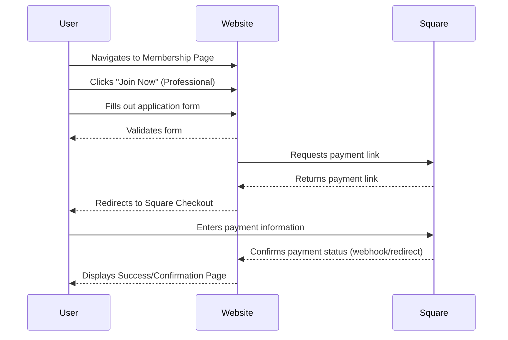
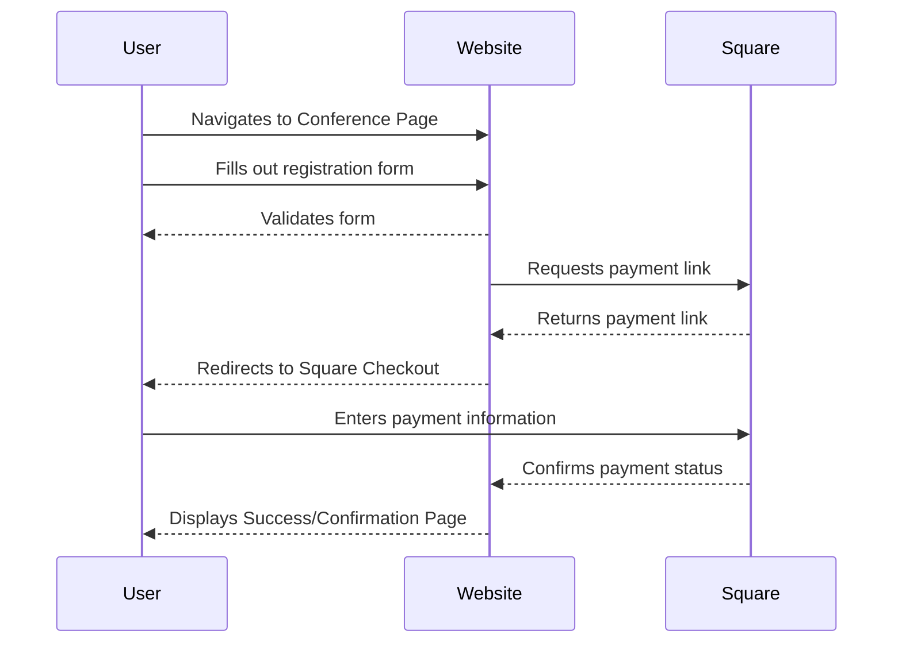

# User Flow Optimizations

## Membership Application Flow

### Optimization Guidelines

- **Form Validation**: Implement real-time validation to prevent errors before submission
- **Progress Indicators**: Show users where they are in the multi-step process
- **Auto-save**: Save form progress to prevent data loss
- **Clear Call-to-Actions**: Use prominent, descriptive buttons that guide user actions

## Conference Registration Flow

### Flow Optimization Priorities

1. **Minimize Form Fields**: Only collect essential information upfront
2. **Smart Defaults**: Pre-populate known user information when possible
3. **Error Recovery**: Provide clear paths to resolve form validation errors
4. **Payment Security**: Ensure secure payment processing with clear security indicators
5. **Confirmation Clarity**: Provide detailed confirmation with next steps and contact information