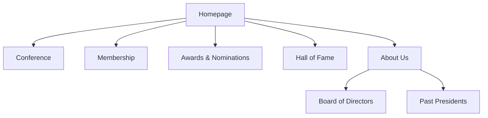

# UX Goals & Principles

## Target User Personas

**Current & Prospective Members**: Professionals who need efficient access to information and streamlined processes for joining, renewing, and registering for events.

**Students**: Future professionals who need a simple and clear path to apply for membership.

**The Public & School Administrators**: An audience that requires a professional and clear presentation of the association's mission and impact.

## Usability Goals

**Ease of Learning**: A first-time visitor should be able to understand the site's purpose and successfully complete a core task (like finding conference info or starting a membership application) within minutes.

**Efficiency of Use**: Key tasks like paying for a conference or membership should be completable in as few steps as possible.

**Error Prevention**: Forms and payment flows will have clear validation and guidance to prevent user errors.

## Design Principles

**Clarity Above All**: The interface will prioritize clear, unambiguous language and intuitive navigation over clever or complex design.

**Streamlined Workflows**: Every task, especially multi-step processes like registration and payment, will be designed to be as simple and frictionless as possible.

**Trust & Transparency**: The design will build user trust, especially during payment, with clear communication, professional aesthetics, and secure-feeling interactions.

## Information Architecture (IA)

### Site Map

### Navigation Structure

**Primary Navigation**: The main site header will contain links to the primary pages: Conference, Membership, Awards & Nominations, Hall of Fame, and About Us.

**Footer Navigation**: The footer will contain links to the primary pages as well as the newsletter signup form.

## Agile Team Perspective Shift

### Product Owner Perspective (Sarah) - Requirements & Business Value

**Target User Persona Analysis:**
- **Acceptance Criteria Gap**: Current personas lack measurable user success metrics. Need to define specific completion rates and time-to-task benchmarks for each persona.
- **Business Value Clarification**: Missing ROI metrics for UX improvements. Should quantify member retention impact and conversion rate improvements.
- **User Story Dependencies**: Current personas need to be mapped to specific epic requirements to ensure feature prioritization aligns with user needs.

**Usability Goals Refinement:**
- **"Ease of Learning" Requirements**: Define specific success criteria - 80% of first-time visitors should complete primary task within 3 minutes without assistance.
- **"Efficiency of Use" Validation**: Need baseline metrics for current task completion times to measure improvement. Target: reduce membership application time by 40%.
- **"Error Prevention" Acceptance**: Establish error rate thresholds - less than 5% form abandonment rate, less than 2% payment processing errors.

**Process Adherence Recommendations:**
- All UX principles must be validated through user acceptance testing before development completion.
- Information Architecture changes require stakeholder review and approval workflow.
- Design principles need traceability to specific user story acceptance criteria.

### Developer Perspective (James) - Technical Implementation

**Technical Feasibility Analysis:**
- **Clarity Above All**: Requires standardized component library and design system implementation. Need to establish TypeScript interfaces for consistent prop definitions.
- **Streamlined Workflows**: Multi-step processes need state management strategy (Context API vs Redux). Payment flows require secure token handling and error boundary implementation.
- **Trust & Transparency**: Security implementation requirements - SSL certificates, secure payment integration, input validation, and error handling patterns.

**Implementation Dependencies:**
- **Navigation Structure**: Requires routing configuration with Next.js App Router. Need SEO optimization for each primary page.
- **Site Map Architecture**: Mermaid diagram needs translation to actual routing structure with dynamic segments for user-specific content.
- **Mobile-First Approach**: All components must be responsive by design. Need CSS-in-JS or Tailwind implementation strategy.

**Development Standards Enforcement:**
- All UX principles must translate to testable code patterns.
- Component specifications need TypeScript definitions and Storybook documentation.
- User flows require integration test coverage with Playwright or Cypress.

### QA Perspective (Quinn) - Quality Assurance & Testing Strategy

**Quality Assurance Framework:**
- **Usability Testing Strategy**: Each usability goal requires corresponding test scenarios with measurable success criteria and failure conditions.
- **Cross-Browser Compatibility**: All design principles must be validated across Chrome, Firefox, Safari, and Edge with automated visual regression testing.
- **Accessibility Compliance**: Navigation structure and user flows must meet WCAG 2.1 AA standards with automated testing integration.

**Risk-Based Testing Priorities:**
- **High Risk**: Payment processing workflows, form validation, and user authentication flows.
- **Medium Risk**: Navigation consistency, mobile responsiveness, and content management integration.
- **Low Risk**: Visual design consistency and informational content presentation.

**Performance Quality Gates:**
- **Page Load Performance**: All pages must load within 3 seconds on 3G connections.
- **Interactive Performance**: User interactions must respond within 100ms with appropriate loading states.
- **Error Recovery**: All error states must provide clear user guidance and recovery options.

**Testing Architecture Requirements:**
- Unit tests for all utility functions and validation logic.
- Integration tests for complete user workflows from start to finish.
- Visual regression tests for design consistency across viewports.
- Performance monitoring with Core Web Vitals tracking.

## Team Alignment Summary

**Shared Priorities:**
1. **User-Centered Approach**: All three perspectives emphasize the need for measurable user success metrics.
2. **Quality Standards**: Consistent emphasis on error prevention, performance, and accessibility.
3. **Systematic Implementation**: All perspectives require structured, testable, and maintainable solutions.

**Integration Requirements:**
- UX goals must include measurable acceptance criteria (PO requirement).
- Design principles must translate to reusable, tested components (Dev requirement).
- All user flows must have comprehensive test coverage (QA requirement).

**Next Steps Consensus:**
The team agrees that before proceeding to detailed component specifications, we need to:
1. Establish baseline performance metrics for current user workflows.
2. Create a design system foundation with component specifications.
3. Define comprehensive testing strategy that covers all user personas and workflows.